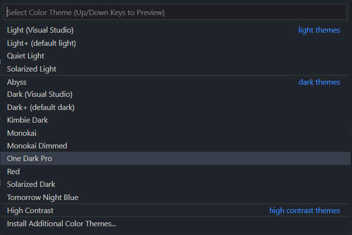

# 
Customizing The Editor

Now we have VS Code successfully installed and running. But you might not like the the way it looks, the theme might be boring for you.Let's fix that, let's change the looks and make it look more cool and awesome.

## Themes

By Default VS Code provides various themes (dark/light) which you can use.

| Dark Theme     | Light Theme     |
| -------------- | --------------- |
| Abyss          | Light           |
| Dark           | Light+          |
| Dark+          | Quiet Light     |
| Kimbie Dark    | Solarized Light |
| Monokai        | --              |
| Monokai Dimmed | --              |

To change the theme, open command Palette `CMD/CTRL + SHIFT + P` and type '**Preferences: Color Theme**'

**Note:** This list has some additional themes installed.

### Installing Additional Themes

You might not like the default themes and would like to use a theme that you saw in one Youtube video or your favorite developer is using that one.

To install an additional theme:

- Go to Extensions (`CMD/CTRL+SHIFT+X`)
- Type `category:themes`, and you will see list of themes available.
- Choose the one you like and install it.
- After installation, you will be able to see the theme in the list and activate it.
