# 
Customizing The Editor

Now we have VS Code successfully installed and running. But you might not like the the way it looks, the theme might be boring for you.Let's fix that, let's change the looks and make it look more cool and awesome.

### Themes

By Default VS Code provides various themes (dark/light) which you can use.

| Dark Theme     | Light Theme     |
| -------------- | --------------- |
| Abyss          | Light           |
| Dark           | Light+          |
| Dark+          | Quiet Light     |
| Kimbie Dark    | Solarized Light |
| Monokai        | --              |
| Monokai Dimmed | --              |

To change the theme, open command Palette `CMD/CTRL + SHIFT + P` and type '**Preferences: Color Theme**'

**Note:** This list has some additional themes installed.

### Installing Additional Themes

You might not like the default themes and would like to use a theme that you saw in one Youtube video or your favorite developer is using that one.

To install an additional theme:

- Go to Extensions (`CMD/CTRL+SHIFT+X`)
- Type `category:themes`, and you will see list of themes available.
   
  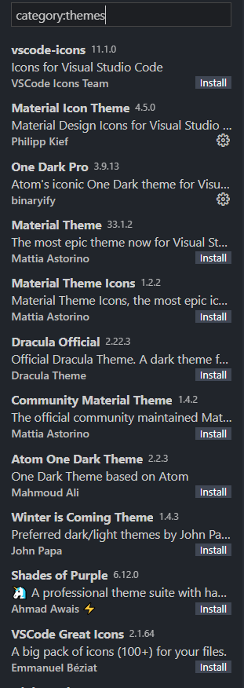
- Choose the one you like and install it.
- After installation, you will be able to see the theme in the list and activate it.

### Changing Font

You can use any font that you like. I love [**Fira Code**](https://github.com/tonsky/FiraCode), if you are intested, you can download it from [here](https://github.com/tonsky/FiraCode/releases/download/5.2/Fira_Code_v5.2.zip)

The reason I love **Fira Code** is that symbols look really cool in it.

<em>Image from Fira Code</em>

 

If you have downloaded **Fira Code** or any other font you want to use, install it like you normally install any font on your Operating System.

Once installed, follow these steps to change your VS Code fonts:

- Go to Settings by using shortcut command (`CMD/CTRL+,`) or by openning settings from Command Palette (`CMD/CTRL+SHIFT+P`), type `Settings` and click on **Preferences: Open Setting (UI)** or **Preferences: Open User Settings**
   
  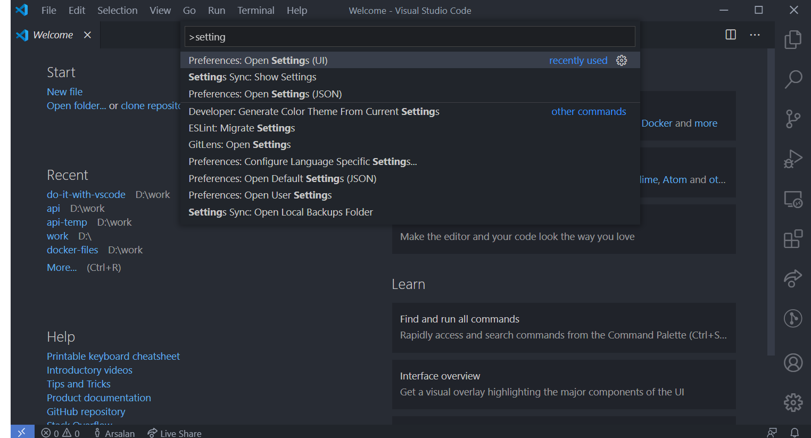
- Search **fontFamily** and update it (`'Fira Code'`)
   
  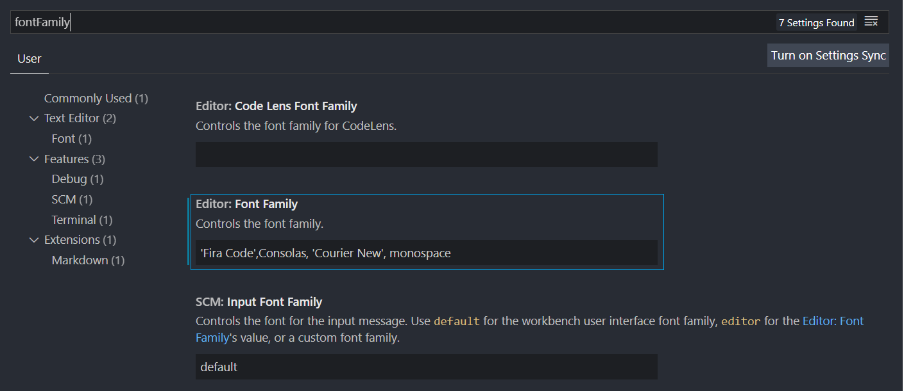
- Search **ligatures** and click on `Edit in settings`
   
  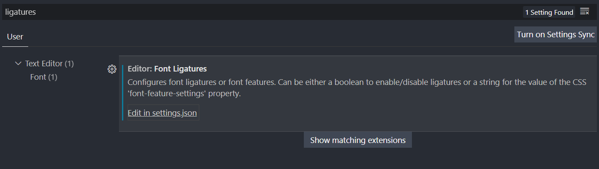
- Add `"editor.fontLigatures": true` to json
   
  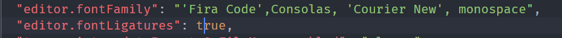

### Tweaking Layout

You can customize and have layout you prefer. Here, I'll make few tweaks, which I personally like. If you like the default layout, you can skip this.

#### Minimap

On the right side of your file, there is a minimap.
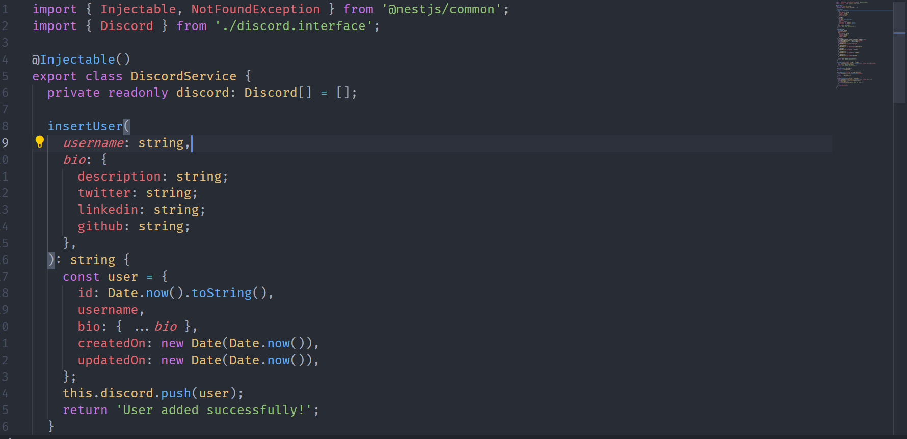
You can move in between your code by interacting with minimap but I don't find minimap much useful, it only takes space. To disable minimap to have extra space by going to `View` and uncheck `Show Minimap`
 
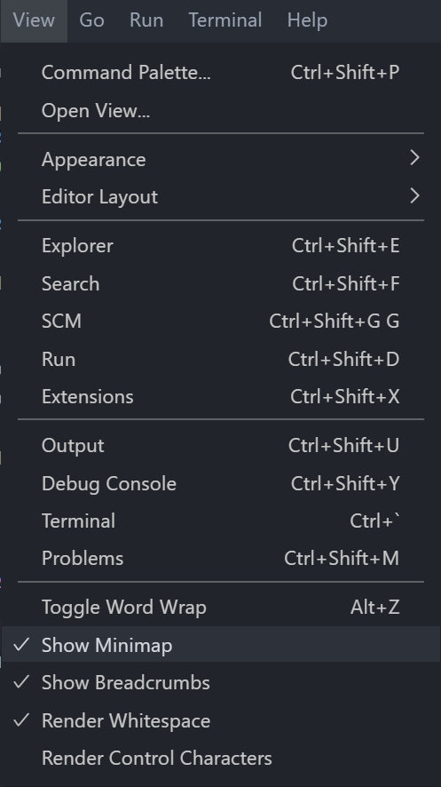

#### Changing Sidebar

The side bar is currently located on the right and when you open/close it, your code adjust itself. It will be better to move it to left, so your code doesn't adjust
To do that,

- Open Settings (`CMD/CTRL+,`)
- Search for `side bar`
- Change its value to `right`
   
  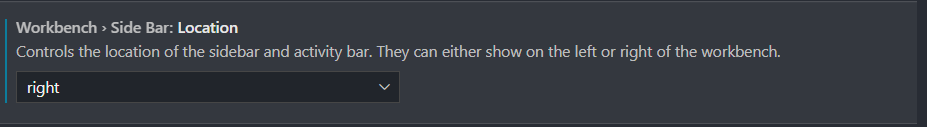

#### Tweaking Title

VS code gives a lot of flexibility, and taking advantage of that, you can even customize your title bar from this

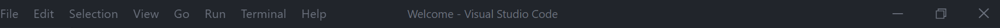

to something like this

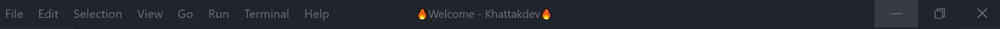

To tweak your title

- Open Settings (`CMD/CTRL+,`)
- Search `title`

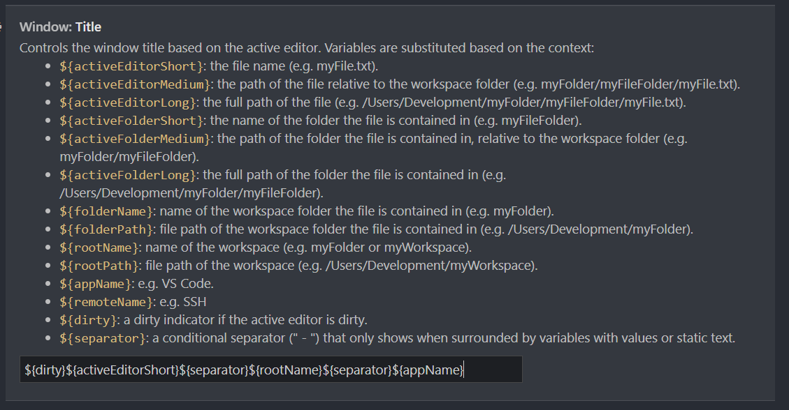

- Tweak it.
