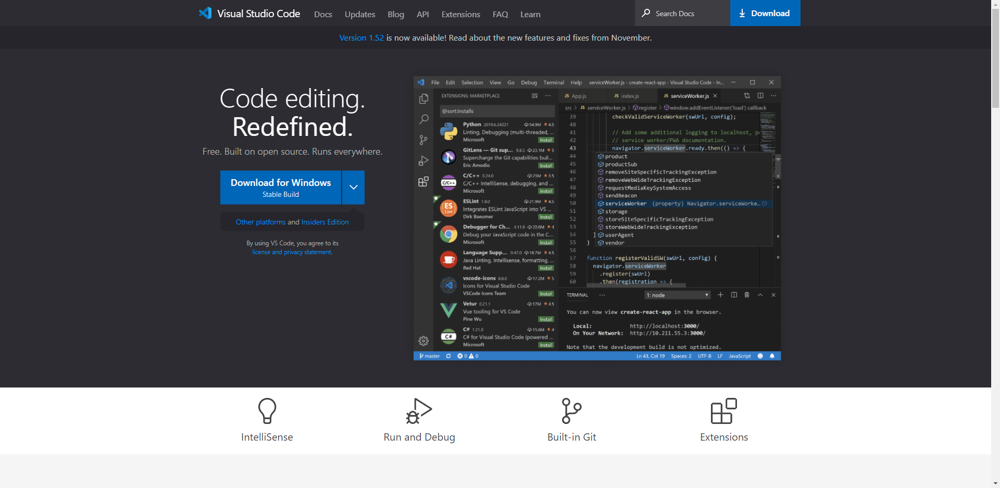

# 
Getting Started

[Visual Studio Code](https://code.visualstudio.com/) is a free open source code editor by Microsoft for Windows, Mac and Linux.

Let's download and install the code editor from [VS Code website](https://code.visualstudio.com/).

## To be continue
