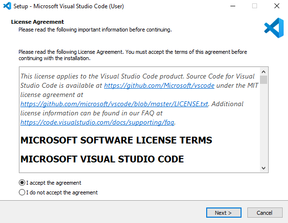
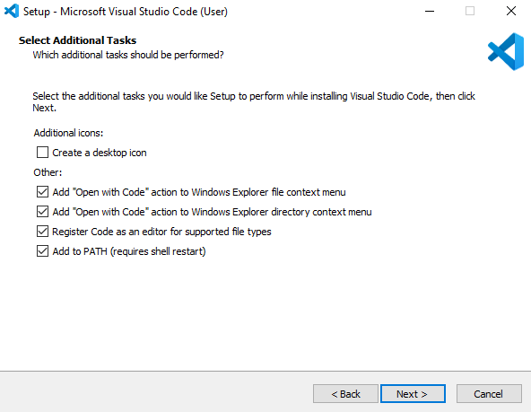
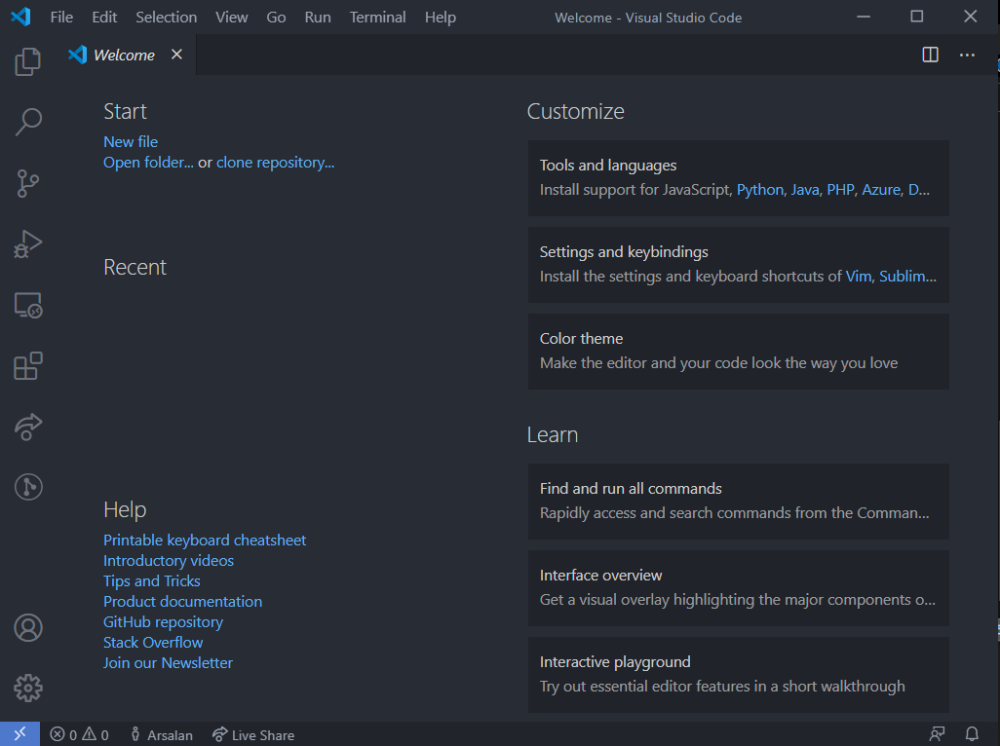

# 
Getting Started

### Download

[Visual Studio Code](https://code.visualstudio.com/) is a free open source code editor by Microsoft for Windows, Mac and Linux.

Let's download and install the code editor from [VS Code website](https://code.visualstudio.com/).

### Installation

Once downloaded, install the VSCode locally.

When you click on **Next**, you'll see multiple options, if you are not sure which one to check, here's my settings.

Once installed, go to task bar. Search and open **Visual Studio Code**

**Note:** I've some extensions installed, your VS Code will not look exactly like the above screenshot.
