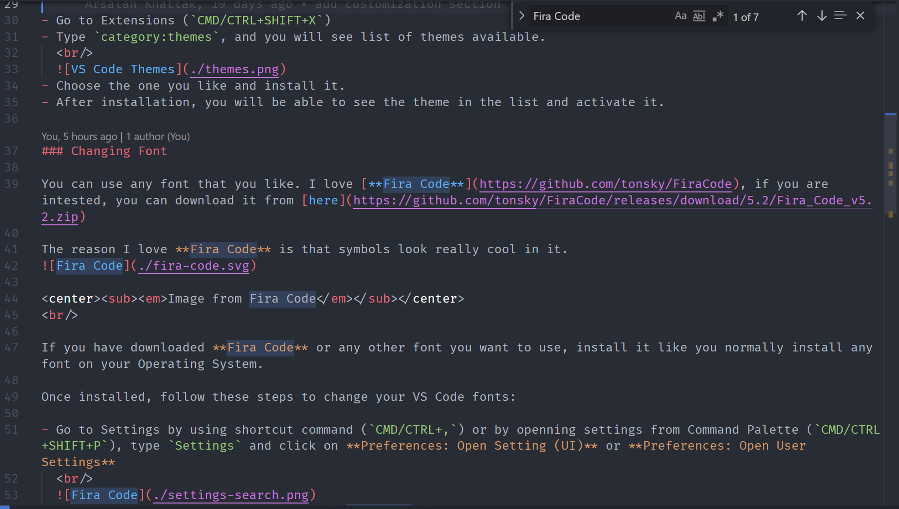
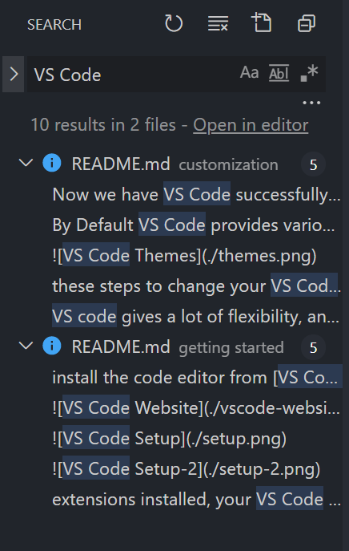
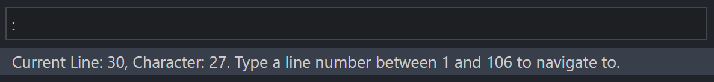
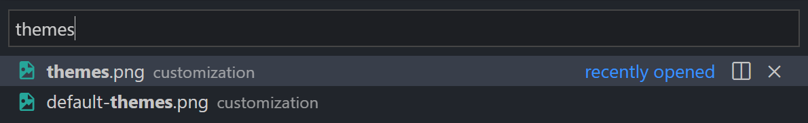
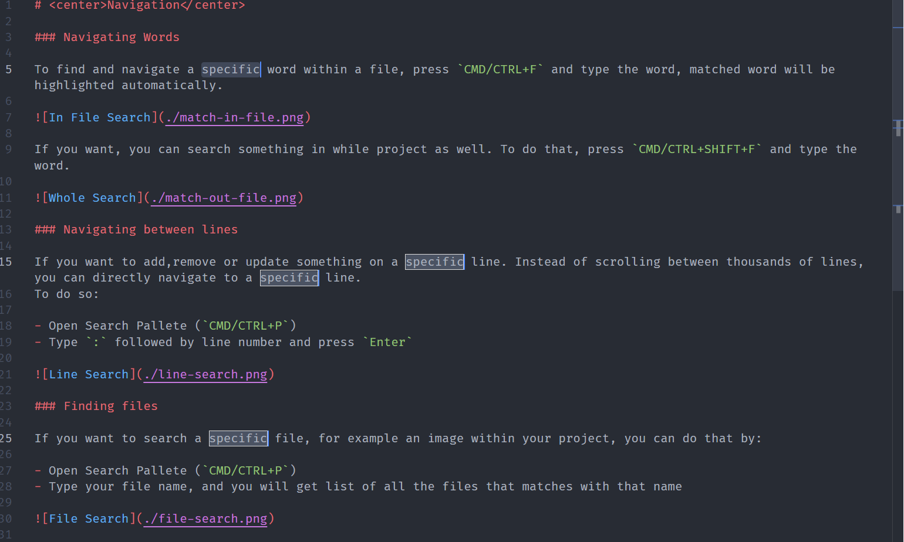

# 
Navigation

### Navigating Words

To find and navigate a specific word within a file, press `CMD/CTRL+F` and type the word, matched word will be highlighted automatically.

If you want, you can search something in while project as well. To do that, press `CMD/CTRL+SHIFT+F` and type the word.

### Navigating between lines

If you want to add,remove or update something on a specific line. Instead of scrolling between thousands of lines, you can directly navigate to a specific line.
To do so:

- Open Search Pallete (`CMD/CTRL+P`)
- Type `:` followed by line number and press `Enter`

### Finding files

If you want to search a specific file, for example an image within your project, you can do that by:

- Open Search Pallete (`CMD/CTRL+P`)
- Type your file name, and you will get list of all the files that matches with that name

### Renaming

If you want to rename variable/function name or something that is used multiple times in your file, instead of manually changing the name one by one, what you can do is:

- Highlight the word
- Use (`CMD/CTRL+D`) to select next location of the word (keep doing it until all of them are selected)
- Rename it

