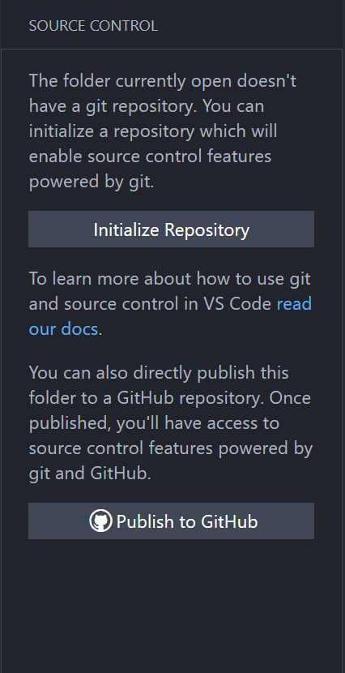
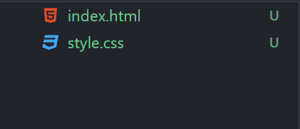
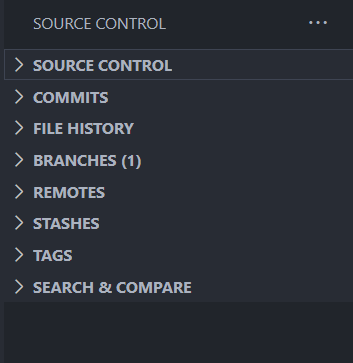
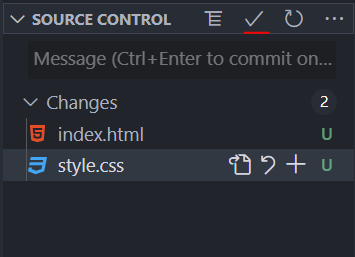
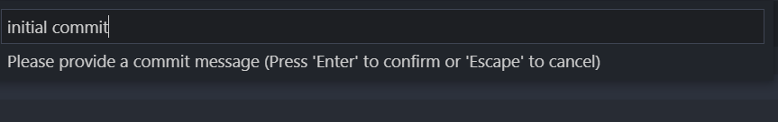
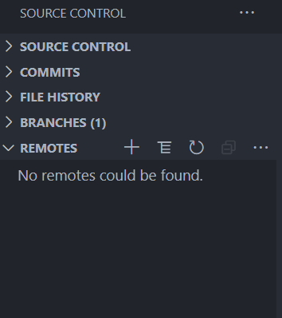
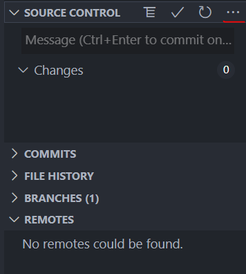
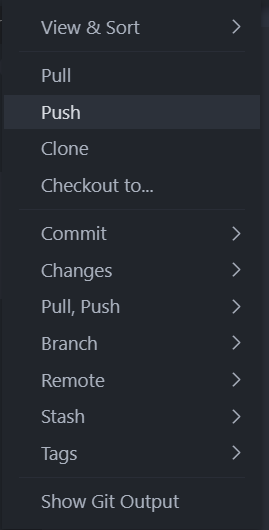

# 
Navigation

VS Code has built-in Git support, which you can use if you are someone who prefers GUI over terminal. You don't need to install any third-party software to manage your version control.

### Initialization Git

The very first step to work with Git is to intialize a repository and create a *.git* folder, which we do by using `git init`. To perform this step using VS Code built-in Git support, simply open the source control by side bar and click on **Initialize Repository**.

Once initialized, you'll be able to see the folders/files name in a different color.

If you open again the **source control** tab from side bar, you'll different useful tabs, such as:
* Uncommited files
* Commit history
* Branches
* Remote repostories
etc

### Commit

To do something like `git commit ...`, simply click on the *tick mark* at the top and confirm the message.

It will ask you to enter commit message.

Once done, it will commit the changes.

### Remote Repository
There are multiple ways to link your local repository with remote repository. One way is to open *Remotes* tab, click on the plus icon

### Push/Pull

Once you connect your local repository to remote one, you can pull/pull the code from the remote repository. To do so, open the three dots on the top, next to *Source control*

From here you can either push or pull the code from repository.

